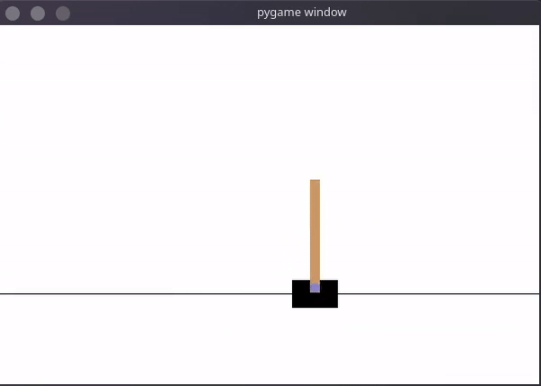

# cartpole-balancing-agent

An AI agent balances the pole on a cart from falling. The Agent uses deep Q learning to approximate the q values for state-action pairs. The DQN model consists of two networks the policy network, and the target network. The policy network is trained by sampling a batch of experiences from the memory (experience replay). The target network is used to approximate the q-values for the next states. The weights in the target network are updated after N episodes which maintain the stability of the network.

<p align="center">
  
</p>

## Run my project

To train the agent, run the following command.
(note: If you train the agent, it will overwrite the pretrained model)

```bash
python agent.py --train 200
```
200 is the number of episodes you want the agent to train.

To play the game with the trained agent, run the followig command.

```bash
python agent.py --play 5
```

5 is the number of episodes you want the agent to play the game. The episode will terminate when the agent scores 500 points.

## Requirements

- [Python] (https://www.python.org/downloads/) >= 3.7
- [Pytorch] (https://pytorch.org/) >= 1.3.1
- [gym] (https://gym.openai.com/)
- [pygame] (https://www.pygame.org/)

## Reference 
*David Silver. [Deep Reinforcement Learning](https://icml.cc/2016/tutorials/deep_rl_tutorial.pdf). ICML conference, 2016.*


